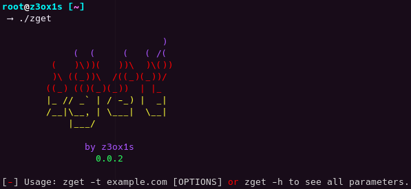

## 🤔 What is zget?
- zget is a tool to make HTTP Requests.

  

## ☁️ Download
   - For a easy download, click in the button `Code` and `Clone` or `Download ZIP`
   - If you want to use SSH, you can use `git@github.com:z3ox1s/zget.git`
   - If you want to use HTTPS, you can use `git clone https://github.com/z3ox1s/zget.git` *(recommended)*

  

## ⚙️ Run
   - `cd zget`
   - `python3 zget.py [OPTIONS]`

  

## ⚠️ Warning
- We are not responsible for any malicious use of this tool. You know what you do.

  

## 🧾 Todo List
- [x] Get and Post Method.
- [x] Custom Headers.
- [x] Parse Cookies.
- [x] Parse Data.
- [x] Parse Agent-User
- [x] Response Headers return.
- [x] Add options to download files.
- [ ] Add more HTTP Methods.
