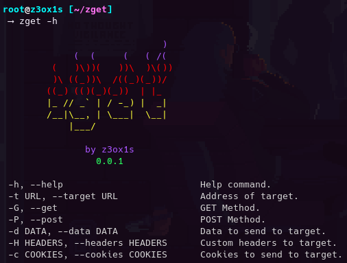

## 🤔 What is zget?
- zget is a tool to make HTTP Requests.

  

## ☁️ Download
   - For a easy download, click in the button `Code` and `Clone` or `Download ZIP`
   - If you want to use SSH, you can use `git@github.com:z3ox1s/zget.git`
   - If you want to use HTTPS, you can use `git clone https://github.com/z3ox1s/zget.git` *(recommended)*

  

## ⚙️ Setup (The auto-installer for now only run in Linux)
   - Linux
      - **Verify if you have `dos2unix` installed using `dos2unix --version`**
      - `python3 setup.py install`
      - `zget [OPTIONS]`
      
   - Windows
      - `python3 zget.py [OPTIONS]`

  

## ⚠️ Warning
- We are not responsable for any malicious use of this tool. You know what you do.

  

## 🧾 Todo List
- [x] Get and Post Method.
- [x] Custom Headers.
- [x] Parse Cookies.
- [x] Parse Data.
- [ ] Output to a pre-determinated file.
- [ ] Response Headers return.
- [ ] Add more HTTP Methods.
- [ ] Add options to download files.
